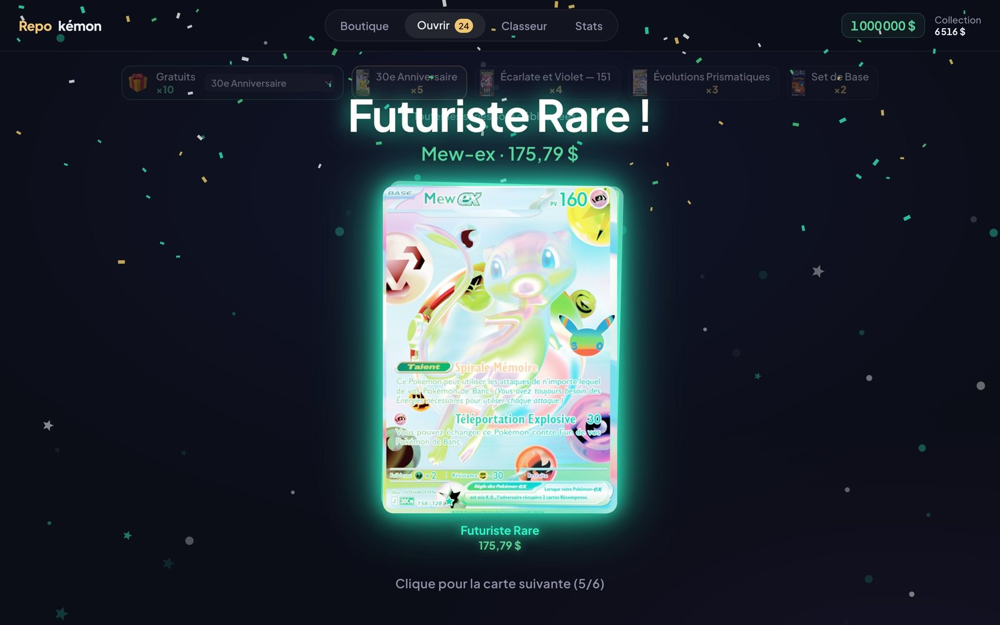
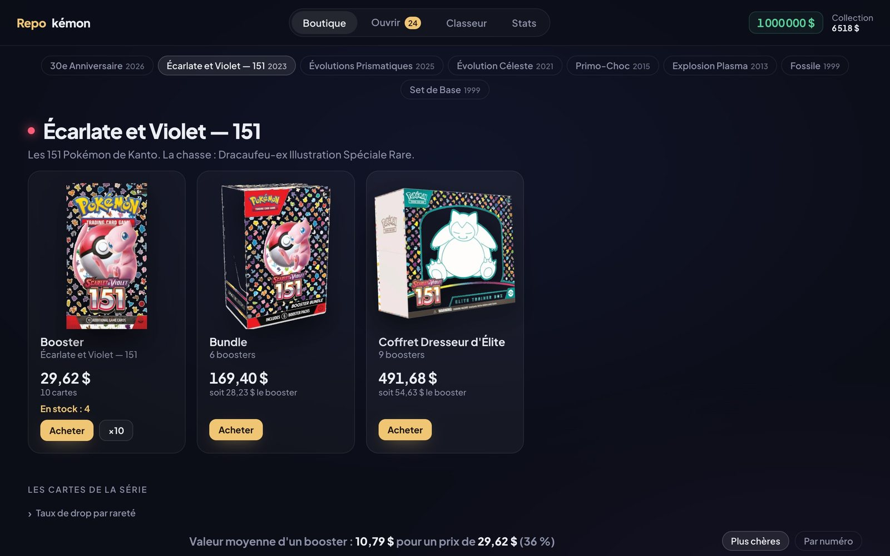
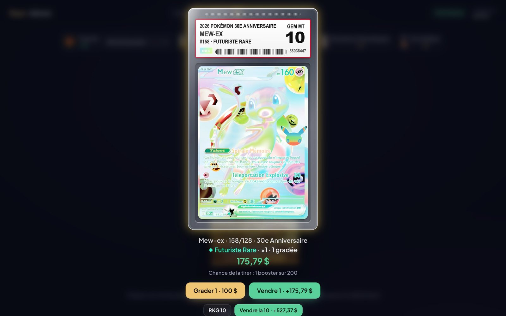
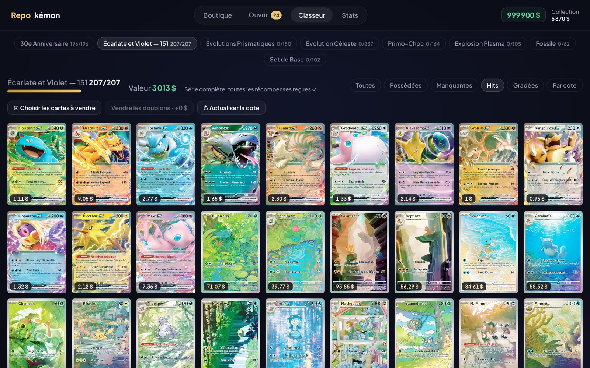

<h1 align="center"><b>Repo</b>kémon</h1>

<p align="center">
  <b>Ouvre des boosters Pokémon, complète tes master sets et fais grader tes cartes.</b><br>
  Cartes en français, cotes du vrai marché, taux de drop réels. Gratuit, dans le navigateur.
</p>

<p align="center">
  <a href="https://tmaxxxx.github.io/REPOkemon/"><b>▶ Jouer en ligne</b></a>
  &nbsp;·&nbsp;
  <a href="https://github.com/tmaxxxx/REPOkemon/releases/latest">Télécharger</a>
</p>

<p align="center"></p>

Projet perso pour le fun, entièrement codé avec Claude Code. Le nom est un clin d'œil à GitHub : *repo* + Pokémon.

## Comment jouer

**En ligne** (ordinateur ou téléphone) : ouvre **https://tmaxxxx.github.io/REPOkemon/**, c'est tout.

**Hors ligne** : télécharge le zip de la [dernière release](https://github.com/tmaxxxx/REPOkemon/releases/latest),
dézippe-le et double-clique sur `index.html`.

Ta partie est sauvegardée automatiquement dans le navigateur. Elle reste liée à ce navigateur (et à ce profil Chrome) :
la version en ligne et la version téléchargée ont chacune leur propre sauvegarde.

| | |
|---|---|
|  |  |
| **Boutique** : boosters, bundles, ETB et displays au prix du marché | **Grading** : boîtier, étiquette, note de 5 à 10 |

<p align="center"><br><b>Classeur</b> : toutes les cartes de chaque série, avec leur cote</p>

## Les séries

Trois séries sont ouvertes dès le départ. Les autres se débloquent en ouvrant des boosters (toutes séries confondues).

| Série | Année | Débloquée à | Produits en boutique |
|---|---|---|---|
| 30e Anniversaire | 2026 | dès le départ | booster, bundle, ETB |
| Écarlate et Violet — 151 | 2023 | dès le départ | booster, bundle, ETB |
| Évolutions Prismatiques | 2025 | dès le départ | booster, bundle, ETB |
| Évolution Céleste | 2021 | 100 boosters | booster, ETB, display |
| Primo-Choc (XY) | 2015 | 250 boosters | booster, display |
| Explosion Plasma (Noir et Blanc) | 2013 | 500 boosters | booster, ETB, display |
| Fossile | 1999 | 1 000 boosters | booster, display |
| Set de Base | 1999 | 1 500 boosters | booster, display |

## Fonctionnalités

**Ouvrir des boosters**
- Déchire le booster en glissant le long des pointillés, puis révèle les cartes une par une,
  avec suspense et effets quand un hit arrive.
- **10 boosters gratuits et 250 $ toutes les 30 minutes**, de la série débloquée de ton choix. Les 10 suivants arrivent
  30 minutes après avoir ouvert le dernier (10 au maximum en réserve).
- Ouverture rapide ×10, contre 200 $ de frais : les 10 boosters s'ouvrent d'un coup et tu fais défiler
  uniquement les hits, le meilleur en dernier.
- Récap à la fin : valeur des cartes comparée au prix payé.

**Économie**
- Tu démarres avec **1 000 000 $**.
- Les cartes et le scellé se revendent à 100 % de leur cote.
- Cadeau de 2 000 $ chaque jour.
- Récompenses de collection : +250 $ à 25 % d'une série, +750 $ à 50 %, +2 500 $ à 100 %,
  et +1 000 $ pour les 30 Pikachu du 30e Anniversaire.

**Grading**
- Fais noter une carte pour 100 $ : elle glisse dans un boîtier, l'étiquette s'imprime et la note tombe, de 5 à 10.
- Un 10 (8 % de chances) triple la cote, un 9 (20 %) la multiplie par 1,5, un 8 ou un 7 ne change rien,
  un 6 ou un 5 la fait baisser. Ça ne vaut le coup que sur les grosses cartes.
- Les cartes gradées s'affichent dans leur boîtier dans le classeur.

**Classeur**
- Toutes les cartes de chaque série, possédées ou manquantes, avec des filtres : hits, gradées, triées par cote…
- Mode vente : coche les cartes à vendre une par une, ou d'un coup (doublons, cartes à moins de 1 $, tout).
- Bouton « Actualiser la cote » pour récupérer les prix du marché en direct.
- Les cartes s'inclinent et brillent au survol de la souris.

**Catalogue (dans la boutique)**
- Avant d'acheter : toutes les cartes de la série avec leur cote, la chance de tirer chacune,
  et la valeur moyenne d'un booster comparée à son prix.

**Stats**
- Argent, valeur de la collection et du scellé, bilan depuis le départ.
- Ton taux de tirage par rareté comparé au taux réel, et tes derniers hits.

## D'où viennent les chiffres

- **Prix du scellé** : cote TCGplayer relevée le 01/10/2026. Displays Set de Base et Fossile : ventes aux enchères 2026.
  Display et ETB Explosion Plasma : ventes eBay 2026.
- **Exception** : les produits 30e Anniversaire coûtent 36 % de plus que leur cote. Les cartes de cette série
  toute récente sont surcotées : au vrai prix, un booster rapporterait 123 % de ce qu'il coûte, donc de l'argent à l'infini.
- **Cote des cartes** : API TCGdex (TCGplayer en dollars, ou Cardmarket converti en dollars).
- **Taux de drop** : taux réels relevés par la communauté. TCGplayer pour 151, Évolution Céleste et 30e Anniversaire,
  taux publiés au lancement pour Évolutions Prismatiques, ThePriceDex pour Primo-Choc et Explosion Plasma,
  une holo pour 3 boosters pour les séries de 1999.

## Mettre à jour les données

Les scripts sont dans le dossier `outils/` :

```
python3 outils/fetch_sets.py    # télécharge cartes + cotes depuis TCGdex (ou : fetch_sets.py xy5 bw10 pour certaines séries)
python3 outils/dl_images.py     # télécharge les images des cartes
python3 outils/build_data.py    # régénère data.js (les prix des produits scellés sont dans ce fichier)
```

## Mention légale

Projet de fan non officiel, sans but commercial. Pokémon et les images des cartes et des produits
appartiennent à Nintendo / Creatures / GAME FREAK / The Pokémon Company.
RKG (Repokémon Grading) est un organisme de grading imaginaire, inventé pour le jeu.
